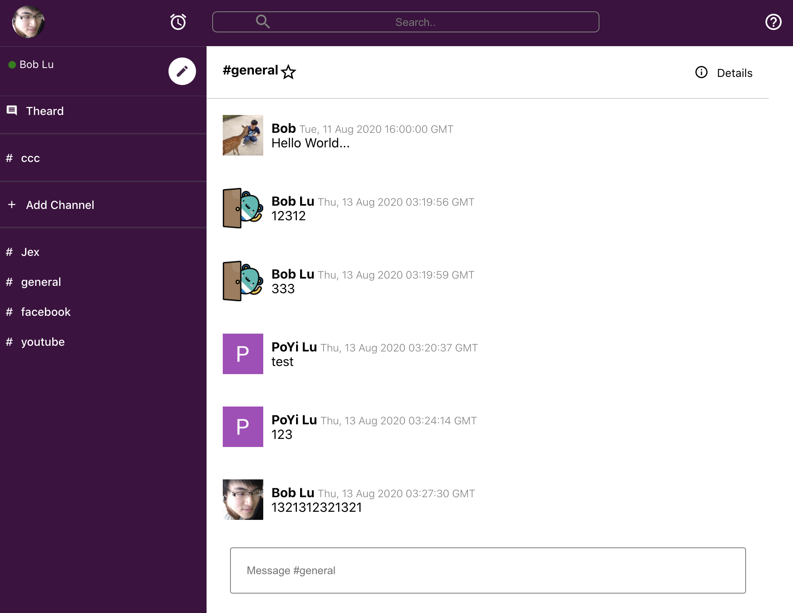
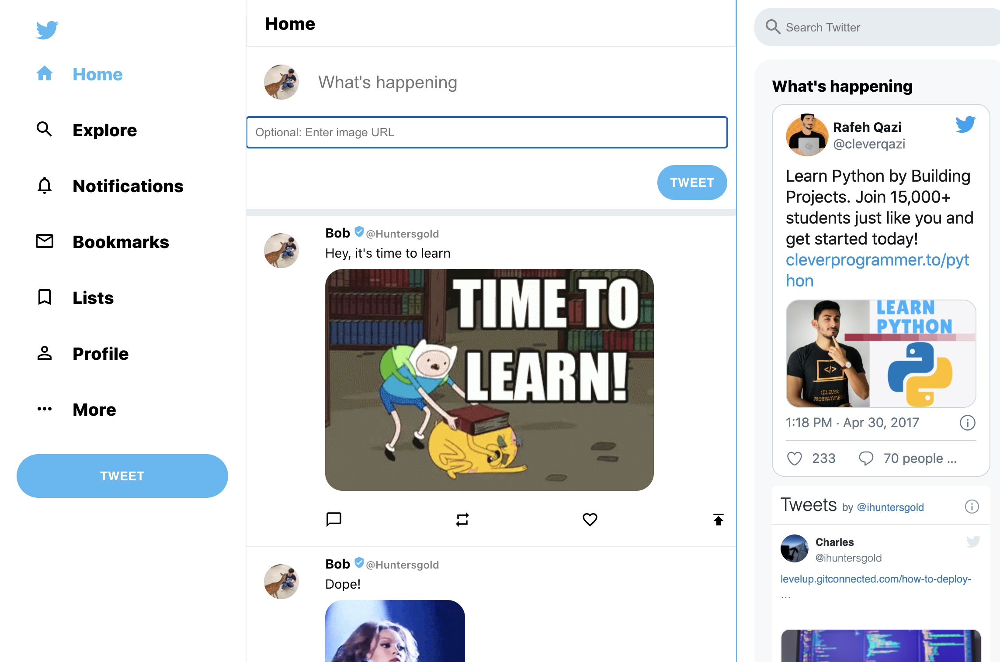
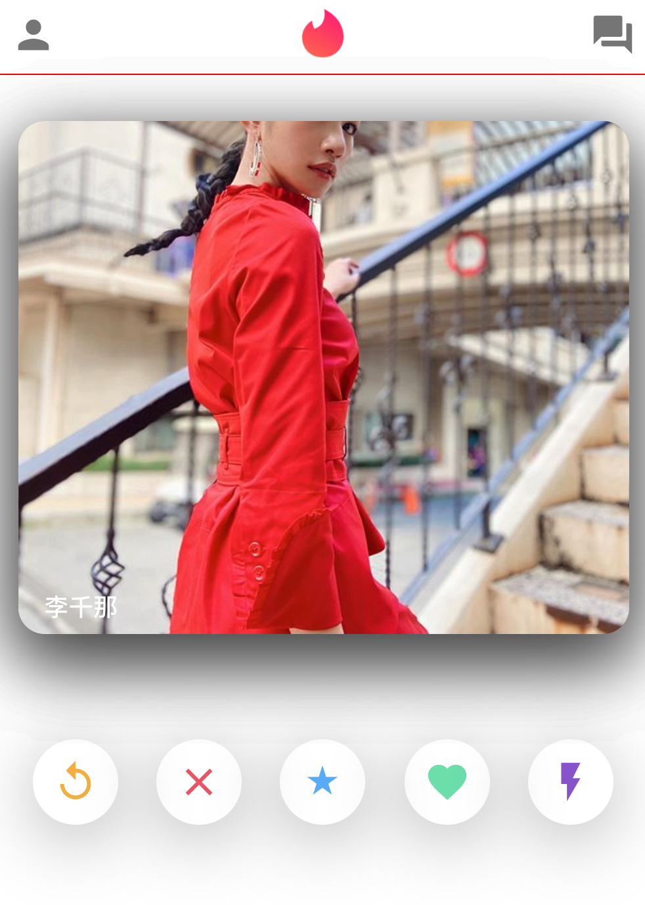
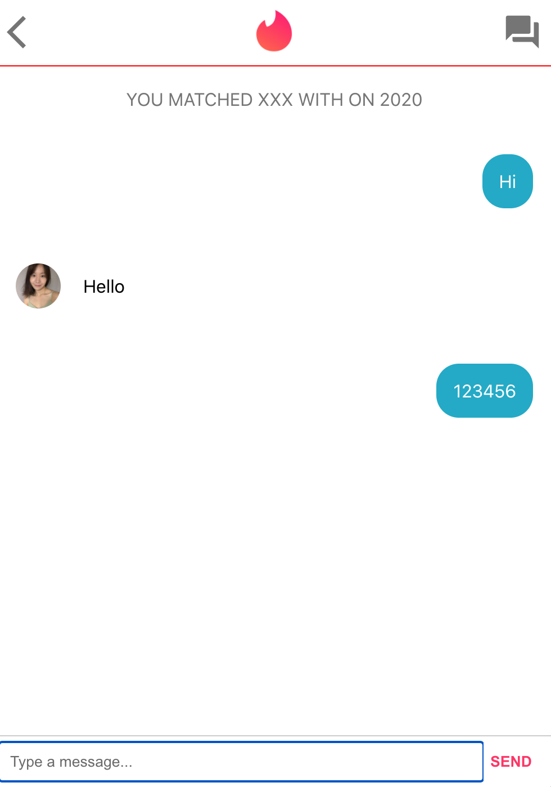

# React Demo

> All the code is from "Clever Programmer", I just watch their video and do step by step and push the code here.

## slack clone

* https://slack-clone-99828.web.app/
  

## twitter clone

* https://twitter-clone-33e08.web.app/
  

## tinder clone 

* https://tinder-clone-c29a2.web.app/

### Reference

Clever Programmer

https://www.youtube.com/channel/UCqrILQNl5Ed9Dz6CGMyvMTQ

https://github.com/CleverProgrammers/