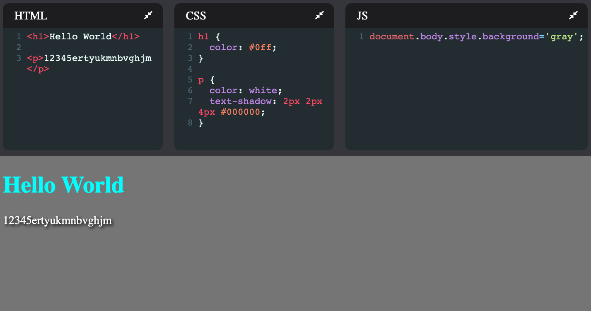
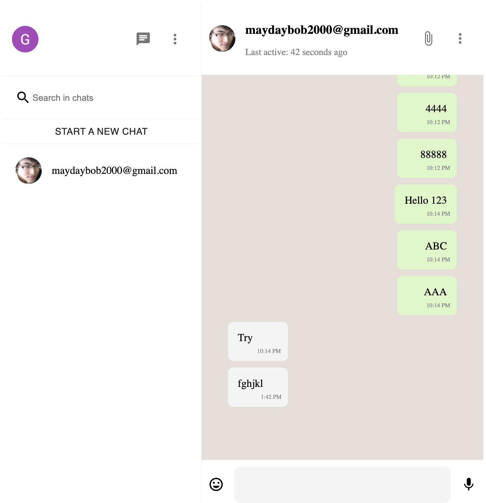

# React Demo

> All the codes are from online course, I watched their videos and do them step by step and pushed here.

## Slack clone - Clever Programmer

- https://slack-clone-99828.web.app/

## Twitter clone - Clever Programmer

- https://twitter-clone-33e08.web.app/

## Tinder clone - Clever Programmer

- https://tinder-clone-c29a2.web.app/

## CodePen clone - Web Dev Simplified

## Whatsapp Next.js clone - Sonny Sangha

- https://whatsapp-v2-beta-woad.vercel.app/

### Reference

Clever Programmer

https://www.youtube.com/channel/UCqrILQNl5Ed9Dz6CGMyvMTQ

https://github.com/CleverProgrammers/

https://www.youtube.com/watch?v=wcVxX7lu2d4

Sonny Sangha

https://www.youtube.com/watch?v=svlEVg0To_c
